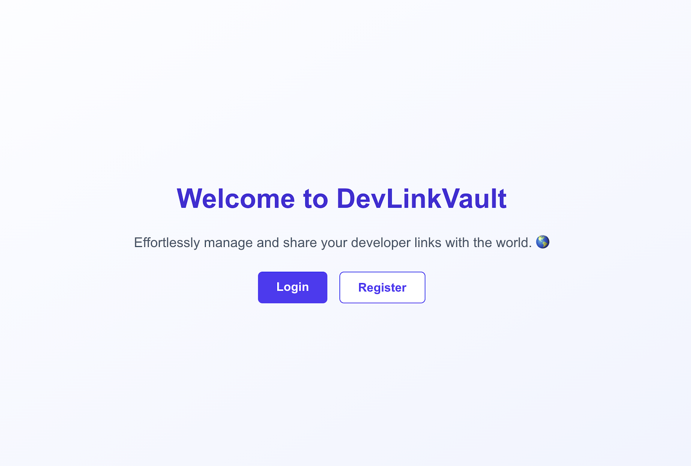

# DevLinkVault 🧰

**DevLinkVault** is a full-stack web application for developers to create and share customizable link profiles. Inspired by Linktree but focused on developers, users can organize their portfolio, GitHub, social links, and more in one beautiful, shareable page.

## 🌐 Live Demo

👉 (https://dev-link-vault.vercel.app/)

---

## ⚙️ Features

* 🔐 **User Authentication** — Secure login with JWT and cookies
* 🧑‍💻 **Developer Profile Pages** — Custom user page with links, avatar, bio
* ➕ **Add / Edit / Delete Links** — Full CRUD functionality for managing links
* 🎨 **Responsive UI** — Built with **Tailwind CSS** and **ShadCN components**
* 🗃️ **Full-Stack Integration** — Frontend (Next.js 14 App Router) + Backend (Express API + MongoDB)

---

## 🛠 Tech Stack

| Frontend                | Backend           | Auth          | Styling               | Database           |
| ----------------------- | ----------------- | ------------- | --------------------- | ------------------ |
| Next.js 15 (App Router) | Node.js + Express | JWT + Cookies | Tailwind CSS + ShadCN | MongoDB + Mongoose |

---

## 📸 Preview



---

## 📂 Project Structure

```
.
├── src
│   ├── app
│   │   ├── api
│   │   ├── auth
│   │   ├── dashboard
│   │   ├── page.tsx
│   │   └── links
│   ├── components
│   ├── lib
│   ├── models
│   └── types
├── public
├── styles
├── .env.local.example
├── next.config.js
├── package.json
└── tsconfig.json
```

---

## 🧪 How to Run Locally

```bash
git clone https://github.com/ChrisMerinoDev/devlinkvault.git
cd devlinkvault
npm install
```

Create a `.env.local` file:

```env
MONGODB_URI=your_mongodb_uri
JWT_SECRET=your_jwt_secret
NEXT_PUBLIC_BASE_URL=http://localhost:3000
```

```bash
npm run dev
```

---

## ✅ Upcoming Features

* Profile themes and color customization
* Public profile sharing with custom usernames
* Analytics for link clicks and traffic

---

## 📄 License

MIT License © 2025 Chris Merino
